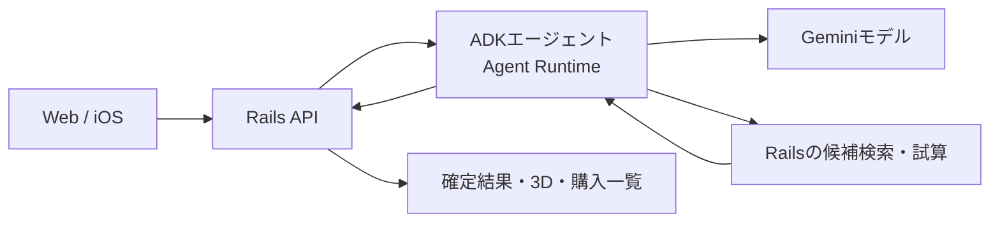

# 商品提案をADKとAgent Runtimeへ移す構成案

Gemini Enterprise Agent Platformで商品提案用のエージェントを1つ動かし、予算・配置・保存は既存Railsに残す案を推奨する。2026-10-05の検討依頼に対する提案であり、実装・本番採用は未決定。

## Agent Platformは既存のGCP推論を含む

Googleの公式資料では、Gemini Enterprise Agent PlatformはVertex AIを発展させた基盤で、モデルの利用とエージェントの開発・実行・管理を含む。先に準備したGCP認証のGemini呼出もこの基盤のモデル利用に当たる。ADKとAgent Runtimeを追加すると、候補検索と検証結果を受けた選び直しをエージェントへ任せられる。

ADKはエージェントをコードで作る開発キット、Agent Runtimeはその実行を管理するGCPサービス。今回はPythonのADKを使う案とする。Railsの認証、DB、Storage、既存クライアントのAPI契約は継続利用する。

## エージェントは検索と選び直しを担当する

写真解析はGCPのGeminiモデル呼出を使い、壁・色・家具の観察結果から既存 `RoomLayout` がシーンを作る。商品提案用のエージェントには、このシーン、活かす家具、希望、予算を渡す。

| 操作 | エージェントの役割 | Railsの役割 |
| --- | --- | --- |
| 候補検索 | 必要な色・用途・枠を指定 | カタログから候補ID・価格・寸法を返す |
| 候補の試算 | 商品候補を選んで検証を依頼 | 予算・配置を計算し、採用結果と除外理由を返す |
| 選び直し | 除外理由を踏まえて代替案を選ぶ | 最終候補を再検証して保存する |

提案上の上限は、初回の選定と必要時の選び直し1回。実行時間、ツール呼出数、モデル呼出数にも上限を設ける。具体的な上限値は既存の全体期限90秒に収まるか測定して決める。全段階に90秒ずつ与えない。

利用者への改善は、たとえば「希望の家具を選んだが置けなかった」場合に、配置不能の理由を受けて代替案を探せること。写真用・検索用・配置用に別々のエージェントを作る必要は、現状の機能からは見当たらない。

## 価格と配置はRailsで検証する

ownerによるデータ分離、候補ID・枠・重複の検査、総予算、家具の保持、手動編集、部屋内への配置はRailsで判定する。購入一覧・合計・3D・説明の商品部分は、最終的に配置した結果から作る。エージェントが渡したuser IDや価格をそのまま採用しない。

実装時には `CoordinationBuilder` の「Planを受け取って試算する処理」を切り出す。現在の `call` はPlannerを呼ぶため、試算ツールからそのまま呼ぶとエージェントの呼出が循環する。

RailsからRuntimeへの呼出と、RuntimeからRailsのツールへの呼出には、サービスアカウントによる認証と処理対象の制限を設ける。エージェントへDBの直接更新を許可しない。セッションやログの保存内容も確認する。モデル側の `store:false` だけでは、Runtimeの会話履歴やログの非保存を保証できない。

## 実商品の検索は別途連携が必要

現在の `InteriorLinks.client` は常に `MockClient` を返す。価格はダミー、購入リンクはECサイトの検索結果であり、実商品の在庫や最新価格を調べる機能はない。エージェント化してもこの制約は残る。実商品検索が必要なら、商品データの取得先と利用条件を決める必要がある。

## Runtime利用料とモデル利用料を合算する

公式料金表では、通常従量料金はAgent Computeが0.085米ドル/vCPU時間、RAMが0.009米ドル/GiB時間。アカウント単位の月次無料枠があり、Computeは50vCPU時間、RAMは100GiB時間。モデルのトークン、セッション等の保存・操作、既存Cloud SQLやStorageなどは別に計上する。利用件数・画像量・反復回数が未確定なので、300米ドルで賄える件数は未算出。

初期案ではRuntimeの最小インスタンスを0にし、最大数を小さく制限する。ただし、インスタンス数などのリソース設定は現在Previewであり、採用時に利用条件を確認する。起動時の待ち時間との兼ね合いは実測で判断する。複数段階の処理が既存HTTP期限を超える場合は、Cloud Tasksなどで非同期処理へ移す必要がある。現在の本番ActiveJobはinline実行。

比較案のADKをCloud Runで動かす構成も可能だが、Agent Platformの管理された実行・観測を使う目的にはAgent Runtimeが合う。Managed Agents APIは別の選択肢で、現在の公式資料では検証向けPre-GA、商用・本番用途に使えないため、この本番構成案には採用しない。

## 請求設定とモデル呼出の本番切り替えは完了

本人のプロジェクトOwner権限は確認済み。本人指定の請求先でクーポン登録とプロジェクトの請求先変更が完了し、利用可能な残高と有効期限を確認した。個人の請求情報は公開リポジトリへ保存しない。Storage、Cloud Run、Cloud SQLの今後の利用料は新請求先、変更前の利用料は旧請求先に残る。全SKUへのクレジット適用は未確認。

クレジット残高は同じ請求先の他プロジェクトとも共有する。個別SKUへの充当と利用後の請求レポートは未確認。

本人の切替依頼を受け、既存APIのモデル呼出をVertexのADC認証へ切り替えた。画像入力と家具提案の実呼出も確認済み。ADKやAgent Runtimeによるエージェント部分は、引き続き構成案の段階。

Google Docs URLは未設定のため、依頼文と既存コードを暫定の根拠とする。この提案とモデル呼出の切替はDocs未反映。

## 2026-10-05に確認した公式資料

- [Agent Platformの概要](https://docs.cloud.google.com/gemini-enterprise-agent-platform/overview)
- [ADKの概要](https://docs.cloud.google.com/gemini-enterprise-agent-platform/build/adk)
- [Agent Runtimeへデプロイ](https://docs.cloud.google.com/gemini-enterprise-agent-platform/scale/runtime/deploy-an-agent)
- [ADKエージェントの呼出](https://docs.cloud.google.com/gemini-enterprise-agent-platform/scale/runtime/use-an-adk-agent)
- [Agent Platformの料金](https://cloud.google.com/products/gemini-enterprise-agent-platform/pricing)
- [Managed Agents APIの制限](https://docs.cloud.google.com/gemini-enterprise-agent-platform/build/managed-agents)
