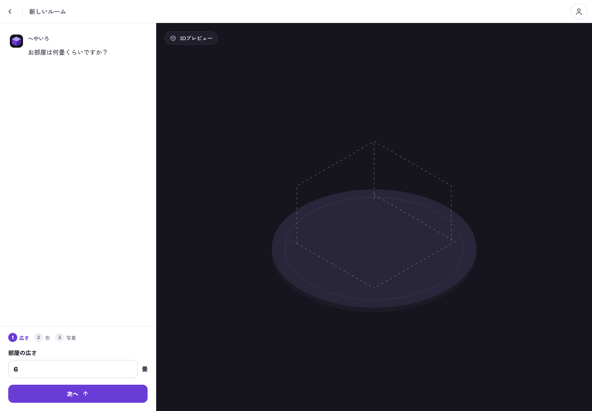
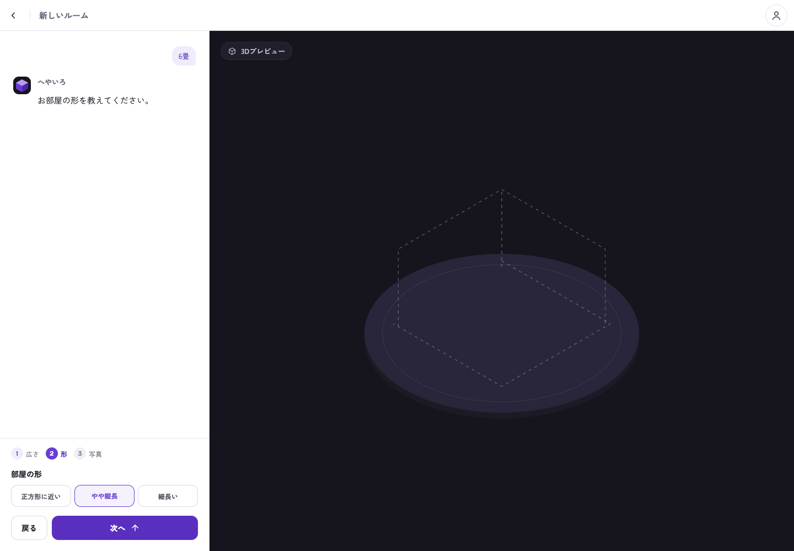
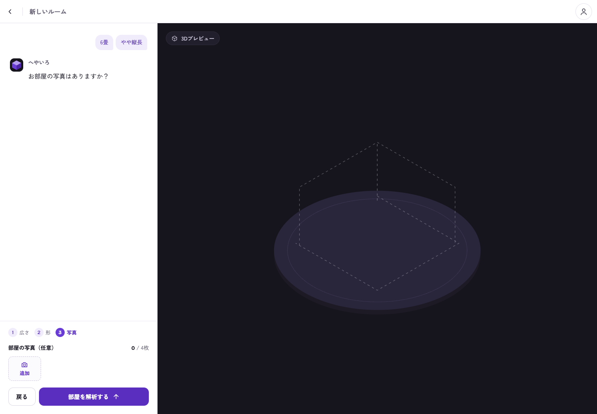

# Room-creation copy investigation (#64)

Source: issue #64, inspected 2026-10-09 against main `36eb6bd64a499615338ee579532ad430ca280de1`. The request asks for investigation before deletion because the target sentence is unidentified. Google Docs is not configured in `docs/project.md`; no Docs confirmation or update is claimed.

## Observed screen

The current API coordination configuration presents three short setup questions at `/rooms/new`, one at a time. Browser inspection used an authenticated local API fixture and desktop Chromium at 1440×1000; no live backend generation was submitted. The screenshots show the current size, shape, and optional-photo steps.

| Candidate and location | Purpose | Proposal and reason |
| --- | --- | --- |
| `お部屋は何畳くらいですか？`, assistant above size input | Asks for the dimension needed for room scale | Keep for now. It duplicates the nearby size label, so removing this assistant question is a possible simplification if this is the requested target. |
| `お部屋の形を教えてください。`, assistant above shape options | Explains the next required choice | Keep for now; it is already one short sentence. Removing it is reasonable only if the request concerns the assistant prompts as a whole. |
| `お部屋の写真はありますか？`, assistant above optional photos | Introduces the optional photo step | Keep the optional status in the field heading. The question itself can be removed if identified as the target; removing the optional label would make skipping unclear. |
| `どんなお部屋にしたいですか？`, request-step variant | Asks for a desired-room prompt in configurations that expose that step | Source inspected, not displayed in the current dimensions flow. Keep unless that specific configuration and sentence is identified. |
| `入力できる項目を確認しています。`, capability-loading fallback | Explains why the next input is not ready | Keep as temporary loading feedback; it is not a persistent explanation paragraph. |
| `3Dプレビュー`, empty scene tag | Names the empty preview region | Keep. This is a label, not an explanation of implementation details. |
| Photo counters, field labels, progress labels, validation errors | Identify controls, required choices, limits, and failures | Keep; deleting them would remove information needed to complete the form or recover from a failure. |

Rendering source: `frontend/src/feature/room/RoomStudioPage.tsx`, `Intro` and the new-room input form. Long explanatory capability messages still exist as repository metadata in `frontend/src/data/repositories/apiRoomRepository.ts:76` and `frontend/src/data/dummy/dummyRoomRepository.ts`, but the current room-creation component does not render `capability.data.message`. They are not evidence of a visible paragraph to delete.

## Recommendation and missing information

No long explanatory paragraph was found on the three inspected creation steps. Do not delete adjacent labels or unrelated login marketing copy based on the original vague note. The next implementation decision needs either the exact sentence, its step (size/shape/photos/request), or confirmation that all assistant setup questions are the intended target. A historical or differently configured screen may explain the note; that is an inference, not a reproduced observation.

This investigation completes the issue's requested inventory and proposals. It intentionally makes no UI deletion. Live deployed configuration, the legacy photo/request flow, and assistive-technology behavior have not been verified.

## Evidence

