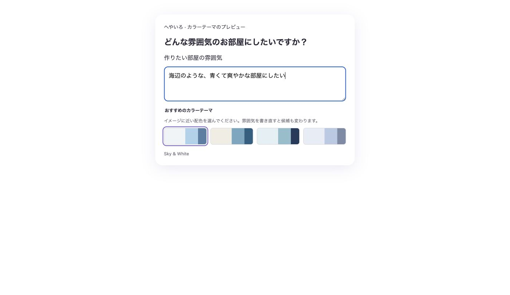

# Atmosphere palettes and dogfood repairs

Related issues: #74, #77. The user explicitly requested sentence-first, few matching palettes, repair of the audit findings, and a PR. This supersedes the previous all-60-visible requirement; all60 remain in the catalogues.

The screenshot shows the actual RoomPalettePicker in an isolated temporary preview. It does not show authenticated generation. Browser checks confirmed zero radios for blank input, four for nonblank input, replacement after changed atmosphere, mouse/keyboard selection, and preservation of the chosen palette for budget-only prose. Japanese/English keyword matching is local and cannot fully interpret nuanced prose or complex negation.

The initial dimensions description now has the downstream 500-character limit in both textarea and wizard validation; legacy photo prompts retain 2000.

The dogfood observation was an unrestricted chair search containing a mattress protector. A repeated live query returned eight seating products, so this observation remains intermittent; the original item's extracted category is unknown. The service previously admitted every floor category when the category selector was blank. Controlled candidates comprised two chairs, a mattress protector classified bed, and a table. [Baseline](baseline-probe.json) accepted all four for 椅子; [13 repaired probes](controlled-probe.json) exclude bed/table candidates, retain explicit category precedence and official-color filtering, and preserve broad contextual/ambiguous searches. This verifies the deterministic category gate rather than provider relevance or the original item's exact classification.

Validation completed locally on 2026-10-09: frontend lint/build passed (existing large-chunk advisory); changed Ruby service RuboCop passed; existing search request specs passed 3 examples; Japanese UI copy lint passed; git diff --check passed. The request specs stub the successful service response, so the controlled probes separately execute the real FurnitureSearch.call. Existing API container and isolated test database were used. No new permanent test files/dependencies were added.

Independent source and finding review found no further actionable defect in the recorded audit. Remaining closed-issue coverage requires generation/import/save/account fixtures and remains partial. No production login, room save/import/generation, merge or deployment was performed for this repair. Google Docs URL remains unset.
