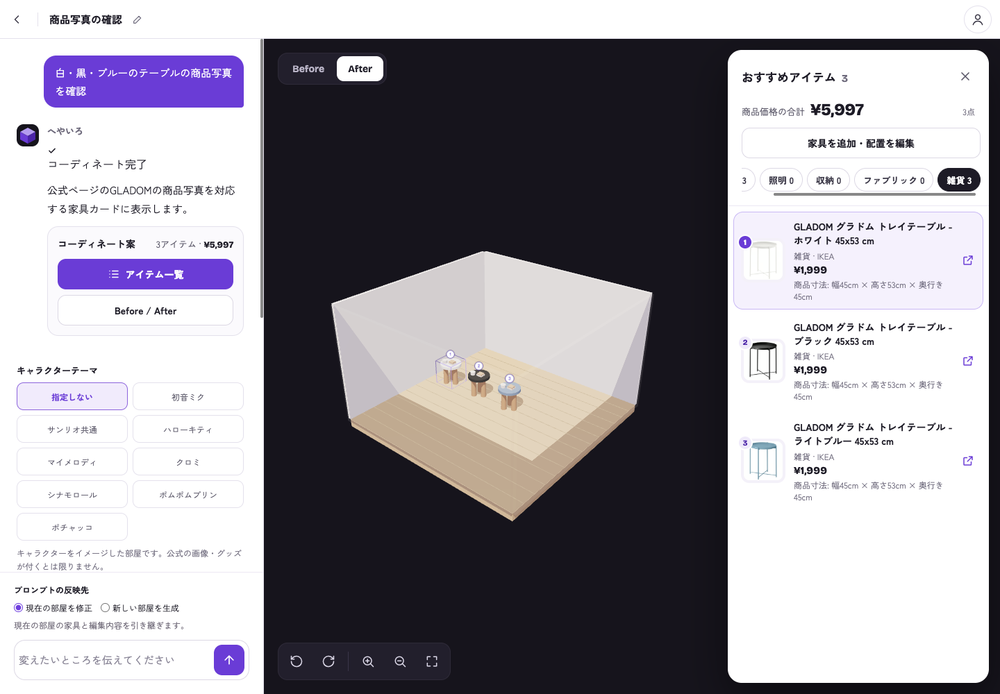
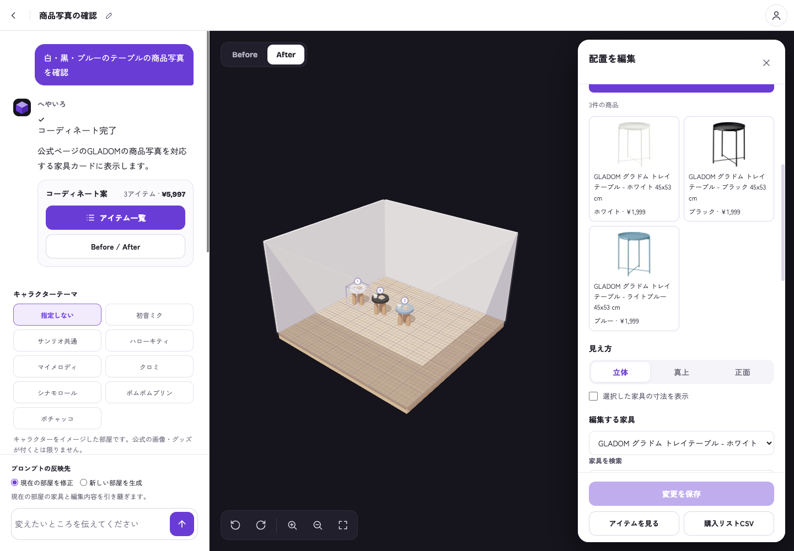
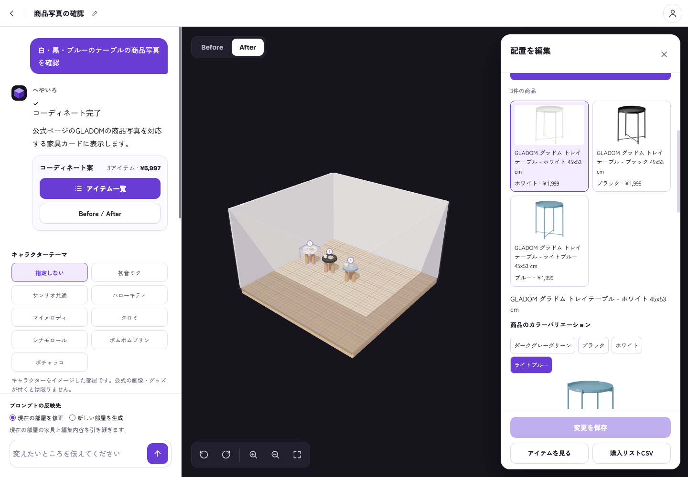
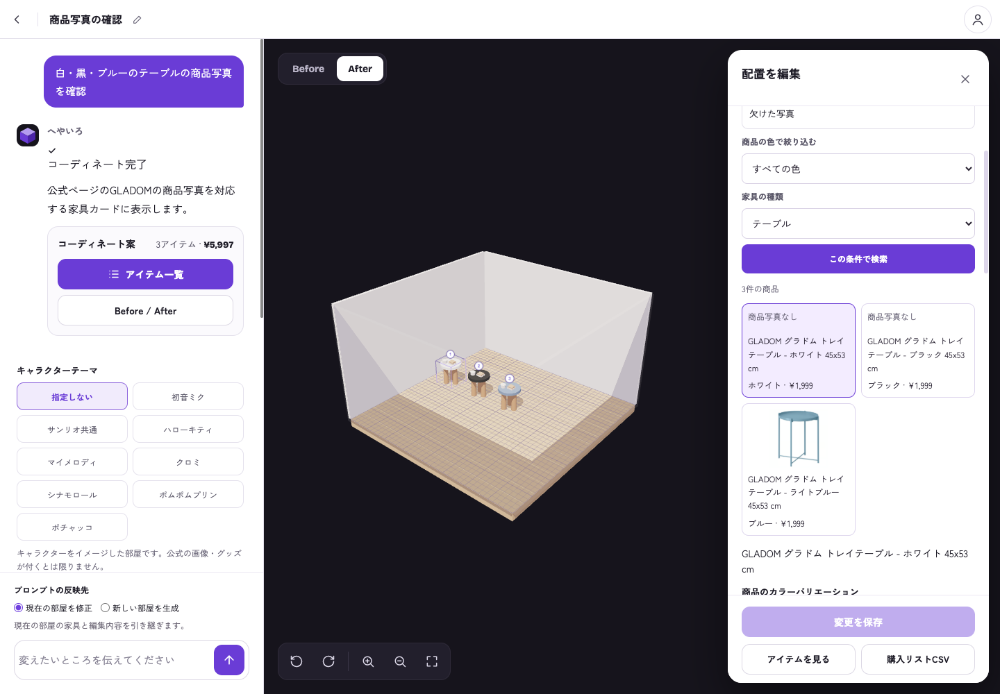
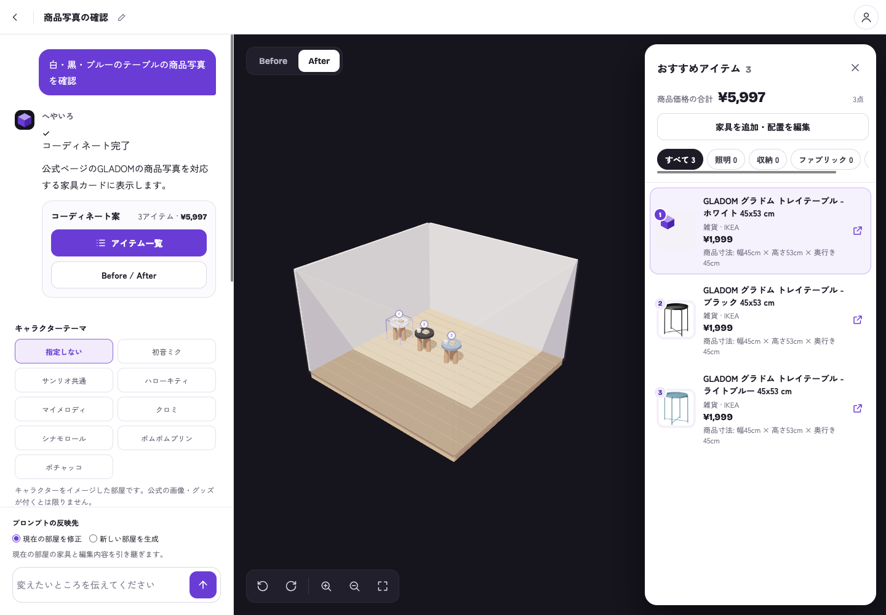

# Product photo verification — issues #60 and #68

The issue scope covers recommendation thumbnails (#60) and furniture search result photos (#68). Source requirements were read from GitHub on 2026-10-09. This evidence depends on the search implementation in PR #90 and the selected-product/photo-fallback changes in PR #97 (#79).

## Photo provenance

Three stored official IKEA HTML pages were compared with the serialized search response by normalized SKU. Each response name and image URL belongs to that exact Product JSON-LD record; the variants use distinct photo URLs.

| Published SKU | Variant | Product photo filename |
| --- | --- | --- |
| 503.378.20 | GLADOM white | gladom-tray-table-white__0470732_pe612912_s5.jpg |
| 004.119.97 | GLADOM black | gladom-tray-table-black__0567223_pe664991_s5.jpg |
| 905.340.03 | GLADOM light blue | gladom-tray-table-light-blue__1500030_pe1006860_s5.jpg |

Official source pages: [white](https://www.ikea.com/jp/ja/p/gladom-tray-table-white-50337820/), [black](https://www.ikea.com/jp/ja/p/gladom-tray-table-black-00411997/), [light blue](https://www.ikea.com/jp/ja/p/gladom-tray-table-light-blue-90534003/).

The backend carries `image_url` alongside product identity through `ProductParser`, `FurnitureSearchSerializer`, `FurnitureImport.scene_attributes`, and recommendation item serialization. Frontend record decoding retains it as `RoomItem.imageUrl`. Both card types render that item's URL; no positional photo array or generic furniture image is used for an available product photo.

## Runtime coverage

The local app was checked at 1440×1000 on the exact integrated PR #97 source `6e266b411f1344ecb56f2623f62b06b97c49b986`. Final dependency `308d38cc63e4dc6406d5713e09cd272f269ecc4f` includes the reviewed backend grouping fix and refreshed replacement evidence; frontend photo code is unchanged. An earlier pass on `c955778` also passed before integration.

| Check | Result |
| --- | --- |
| Three recommendation names/photos/purchase links match their product | Passed |
| Recommendation category filter retains the matching three cards | Passed |
| Table search sends the selected category and renders three matching photos | Passed |
| Choosing the light-blue variant renders its distinct official photo | Passed |
| Changed search conditions hide old cards until the new search | Passed |
| Missing and failed search photos keep selectable cards with “商品写真なし” | Passed |
| Failed recommendation photo retains its card and illustration fallback | Passed |
| Browser uncaught page errors | None |

Screenshots were visually inspected. These are the actual UI with controlled API responses, while successful product images were loaded directly from live IKEA image URLs. Missing-image and failed-image cases were injected deliberately. No new tests were added, and no application code is changed in this evidence PR.

Missing and failed photos use a placeholder/category illustration, never another product's photo.

## Boundaries

The Google Docs URL is unset. API responses are controlled fixtures derived from official HTML, not live Google grounded search or authenticated backend responses. Price and availability are fixture values. Production save, live search, deployment, and every retailer's image extraction are outside this evidence.
