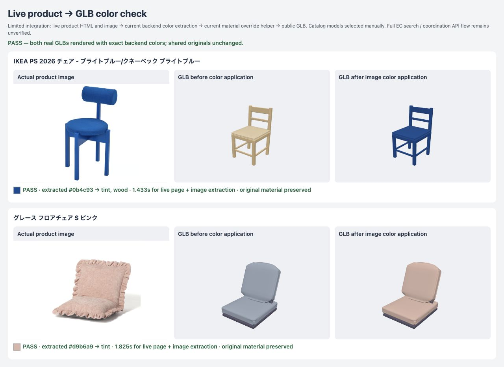

# 商品画像から抽出した色の描画確認

2026年10月8日に、公式商品ページと画像を取得して代表色を抽出し、公開GLBに適用して描画した。左から商品写真、適用前、適用後。

| 商品 | 抽出色 | 商品ページと画像の取得・抽出時間 |
| --- | --- | --- |
| [IKEA PS 2026 ブルーチェア](https://www.ikea.com/jp/ja/p/ikea-ps-2026-chair-bright-blue-knaebaeck-bright-blue-20617964/) | `#0b4c93` | 1.433秒 |
| [Francfranc グレース フロアチェア S ピンク](https://francfranc.com/products/1108010018189) | `#d9b6a9` | 1.825秒 |

現在のバックエンドの色抽出処理とWebの素材適用処理を使った。モデル台帳からGLBを手動で選び、Three.jsで描画した。IKEAの塗装木部にも抽出色が届き、元の共有素材を変えないことを確認した。

計測時間にGLBの読み込みと描画は含まない。商品検索、モデルの自動照合、DB保存、コーデ生成APIから画面表示までの通し動作は未検証。形状・柄・複数素材の色を再現するものではない。
