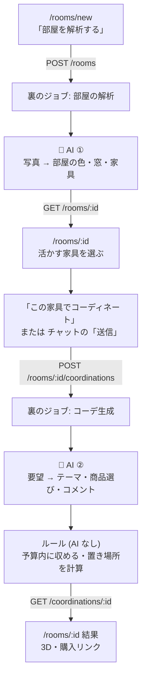

# 部屋のコーデ提案 API (プロトタイプ)

出典: `docs/specification.md`, `docs/system_workflow.png`, `docs/design.png` と担当者 (はせがび) との設計相談 (2026-10-03)。
Google Docs は URL 未設定のため未確認。

## 目的

部屋の写真と「こうしたい」という要望から、今ある家具を活かしたコーデを 3D シーンと購入リンクで返す。
フロント・EC 連携と並行して進められるよう、API 契約 (Scene / Room / Coordination) を先に固める。

## 流れ (system_workflow.png からの変更点を含む)

1. `POST /api/v1/rooms` で部屋の写真・畳数・部屋の形を登録 → `AnalyzeRoomJob` が解析してシーン (部屋の外形 + 今ある家具) を作る
2. クライアントは `GET /api/v1/rooms/:id` をポーリングし、検出された家具から「活かす」ものを選ぶ
3. `POST /api/v1/rooms/:id/coordinations` に要望・予算・活かす家具を送る → `GenerateCoordinationJob`
4. `GET /api/v1/coordinations/:id` をポーリングし、`before_scene` / `after_scene` / `items` を表示する

system_workflow.png からの変更 (Docs 未反映):
- 「活かす」選択のため、解析とコーデ生成の 2 段階に分けた
- 購入リンク一覧はコーデ生成の後に出す (配置できなかった・予算超過の商品を除くため、3D と常に一致する)
- 商品に寸法 (size) を持たせる (3D の縮尺と配置に必須)
- 要望テキスト・予算・活かす家具はコーデ生成にも渡す

## API 呼び出しの流れ

どの画面のどのボタンで API が呼ばれ、その中のどこで AI を使うか (画面は PR #6 の PC ルーム画面)。
🤖 は Gemini につながっている部分、🟡 は AI の代わりのモック。

| 画面 | ボタン | 呼ばれる API | AI |
| --- | --- | --- | --- |
| `/rooms/new` 新規入力 | 「部屋を解析する」 | 写真があれば `POST /uploads` → 写真を PUT → `POST /rooms` (`photo_keys`) → 終わるまで `GET /rooms/:id` | 🤖 **① 写真から部屋と家具を読み取る** (`RoomAnalyzer::Gemini`。写真か API キーが無ければモック) |
| `/rooms/:id` 活かす家具の選択 | 「この家具でコーディネート」 | `POST /rooms/:id/coordinations` → 終わるまで `GET /coordinations/:id` | 🟡 **② 要望から商品を選び、タイトル・コメントを書く** (`CoordinationPlanner`) |
| `/rooms/:id` 結果 | チャットの「送信」(追加指示) | 同じ部屋に `POST /rooms/:id/coordinations` → `GET /coordinations/:id` | 🟡 ② と同じ |
| `/rooms/:id` 結果 | 配置・色の編集、保存、購入リスト CSV | なし (ブラウザの中だけ) | − |

- AI は「ボタンの API」の中ではなく、**その後に裏で動くジョブの中**で呼ぶ。ボタンの API はすぐ返り、画面は `GET` で完了を待つ。
- 新規入力画面で写真を付けると、署名付き URL で GCS (ローカルでは `tmp/storage`) へ直接送り、その key を `POST /rooms` に渡す (PR #12。写真は任意)。



## 重要な設計判断

- **部屋の 3D は写真から復元しない**。寸法と家具の配置を推定し、箱で組み立てるシーン JSON として返す。
  写真だけでは実寸が出ないので、**畳数 (`tatami`) と部屋の形 (`shape`) を必須入力**にする (2026-10-04 決定)。
  `shape` は STEP1 の 3 択チップ: `square` 正方形に近い (幅:奥行き = 1:1.15) / `standard` やや縦長 (3:4) / `long` 細長い (1:2)。
- **入力は部屋の写真**。写真から (1) 部屋の外形 (色・窓) を作り、(2) 家具を抽出して事前に用意した 3D モデルから選び、
  (3) 提案商品も DB から選び、(4) 合わせてクライアントがレンダリングする。
  写真解析の LLM には座標を出させず、位置関係 (どの壁沿いか・どの角か) だけを出させて座標はルールで計算する。
- **家具の 3D は既存モデルを使う**。`model_url` が null ならクライアントが category と size から箱で描く。
  まずはカテゴリ別の汎用モデル、後で商品ごとの事前生成 GLB を足す (画像→3D は当日実行しない)。
- **座標は LLM に出させない**。AI は「どの枠 (slot) にどの商品を入れるか」だけ決め、
  座標は `SlotLayout` がルールで計算する。
- **MVP の枠は布もの・壁・照明・小物**: bed_cover / curtain / rug / wall_decor / light / display / cushion / desk_top。
  床が埋まった部屋でも雰囲気を変えられるよう、家具の上・壁・窓に付けるものを中心にする。
  家具の入れ替え (replace) や床への自由配置は後で広げる。
- **認証なしの公開エンドポイント** (デモ用)。

## 3D モデル

- **既存家具も EC 商品も、3D モデルは事前に用意したものから選ぶ** (当日に画像→3D 生成はしない)。
  - 既存家具・専用モデルの無い商品: カテゴリ別の汎用モデルを `color` で塗り替えて使う
  - デモの主役の商品: item_id ごとの専用モデル (画像→3D で事前生成し、目視で選ぶ)
  - どちらも無ければ `model_url: null` で、クライアントが箱で描く
- **形式は GLB (glTF 2.0) のみ**。クライアントは Web だけなので USDZ などは用意しない (2026-10-04 決定)。
- モデルの決まりごと (案。ほさかと合意が必要):
  - 単位はメートルでおおよそ実寸、+Y が上、**正面は +Z**、**原点は底面中心** (最下端が y=0)
  - 1 点 2 万三角形・1〜2MB まで、テクスチャ 1024px まで、Meshopt で圧縮 (`gltf-transform` で揃える)
  - 塗り替える部分の素材名は `tint`。クライアントはこの素材にだけ `color` を当てる
  - 箱への収め方はモデルごとに `fit: stretch` (縦横奥行きを個別に合わせる: 家具・ラグ・カーテン) か
    `fit: contain` (縦横比を保つ: 植物・照明・小物)
  - 見た目はローポリ・フラット色を基本にそろえる。専用モデル (リアル寄り) と混ぜて違和感がないかは試作で確認
- 対応表は `config/models.yml` (カテゴリ → GLB、item_id → GLB、fit、tint、ライセンス)、
  `ModelResolver` がシーンを返す前に `model_url` を埋める (未実装)。
- 商品専用モデルを前提にするため、商品データは静的 DB 中心になる (EC 連携の方式はうらっしゅと要合意)。

座標系: 単位はメートル。y が上、原点は北西の床の角、x は東、z は南。position は底面中心。
rotation_y は 0/90/180/270 で、正面 (ローカル +z) が南/東/北/西を向く (three.js の rotation.y と同じ)。

## インテリアリンク取得との境界 (うらっしゅ担当)

同じ Rails の中のクラスとして呼ぶ (HTTP ではない)。現在はモックで、本物を作ったら `InteriorLinks.client` を差し替える。

```ruby
InteriorLinks.client.search(prompt:, theme:, slots:, max_price:)
# => { "curtain" => [InteriorLinks::Item, ...], "rug" => [...], ... }
```

- 渡すもの: 要望文 `prompt`、テーマ `theme` (oshi_purple / botanical / korean)、必要な枠 `slots`、上限価格 `max_price` (予算)
- 返すもの: 枠ごとの商品候補 (**おすすめ順**、価格は `max_price` 以下)。選ぶ・置く・予算に収めるのは呼び出し側
- `InteriorLinks::Item`: `id, slot, category, name, price, shop, url, image_url, color, size {w,h,d}`
  - `slot` は `InteriorLinks::SLOTS` のどれか (必須。置き場所が決まらないため)
  - `size` が取れない商品は `InteriorLinks::Item.build` がカテゴリの標準寸法 (`InteriorLinks::DEFAULT_SIZES`) で補う
- 商品の選び方 (`CoordinationBuilder`): 優先度の高い枠から各枠の最安値で予算内にできるだけ多く埋め、
  余った予算で優先度の高い枠からおすすめ順の上位へ格上げする。置き場所が無ければ同じ枠のより安い候補で試す

## 写真の解析の精度を確かめる

解析のたびに `rooms.analysis` (API には出さない) へ、Gemini の生の回答・モデル・考える量・時間・トークン数と、
`RoomLayout` が家具をどう置いたか (指定どおり / ずらした / 別の壁 / 床へ / 捨てた) を保存する。

```bash
# 解析結果を表示する (生の回答と置いた結果を並べる)
docker compose exec api bin/rails 'rooms:report[51]'
# 保存してある写真で解析し直して比べる (考える量・モデルを変えられる。SAVE=1 で部屋に保存)
docker compose exec worker bin/rails 'rooms:reanalyze[51,low]'
docker compose exec worker bin/rails 'rooms:reanalyze[51,,gemini-3.1-flash-lite]'
```

2026-10-04 の試行 (部屋 51・写真 2 枚): `gemini-3.8-flash` は既定の考える量で約 100 秒かかり、その後は混雑 (503) で
解析できないことが続いた。`gemini-3.1-flash-lite` は約 3 秒・有料枠でも約 0.5 円で、家具の種類・色・壁の位置関係は
写真とおおむね合っていた。`gemini-2.5-flash` は新規ユーザーには提供終了 (404)。写真 2 枚では東西の向きの解釈が
回答ごとに揺れるので、3〜4 枚で撮ることを案内する。
この結果から、既定のモデルを `gemini-3.1-flash-lite` にした (2026-10-04 決定)。

## 実装状況

| 部分 | 状態 |
| --- | --- |
| API・DB・非同期ジョブ・Swagger 契約 | 実装済み |
| 枠ごとの配置計算 (`SlotLayout`)・予算内に収める処理 (`CoordinationBuilder`) | 実装済み |
| 写真のアップロード | **実装済み (PR #12)**: `POST /uploads` で署名付き URL を発行し、ブラウザから GCS へ直接送る。`POST /rooms` は `photo_keys` を受け取り、実物があるか確かめる。解析では `Storage.client.download` で読み出す |
| 部屋の解析 (`RoomAnalyzer`) | 写真と `GEMINI_API_KEY` があれば **Gemini** (既定 `gemini-3.1-flash-lite`、Interactions API、写真は長辺 1536px に縮小)、無ければ**モック**。どちらも「どの壁沿いのどのあたりか」だけを返し、座標は `RoomLayout` が計算する。結果の `analyzed_by` で区別できる。**実際のキーでの動作は未確認** |
| 商品の選定 (`CoordinationPlanner`) | **モック**: キーワードでテーマ (推し活パープル / ボタニカル / 韓国) を決める |
| インテリアリンク取得 (`InteriorLinks`) | **モック** (`InteriorLinks::MockClient` + `config/interior_links_mock.yml`、38 点)。価格はダミー、URL は EC の検索結果ページ |
| Webの画面 (`/rooms/new`・`/rooms/:id`) | PR #6の画面・3D編集を基準に統合。畳数・部屋の形 → 活かす家具 → 要望・予算 → 3Dと購入リンク。通信と応答変換は共通の `RoomRepository` に一本化。`/coordinate` は `/rooms/new` へ移動 |
| 本番 (Cloud Run) での Gemini | 本番はジョブが `:inline` (PR #7) なので、`POST /rooms` は Gemini の応答を待ってから返る (flash-lite なら数秒)。写真は GCS から読む。**本番の `GEMINI_API_KEY` (Secret Manager) は未設定**なので本番はモックで動く |
| 3D モデル (GLB) | `ModelResolver` (PR #12) が `config/models.yml` から `model_url` を埋める。モデルはまだ未登録 |

2026年10月4日の依頼により、PR #5をPR #6へ取り込んでからPR #6をmainへマージする。Webの詳細は `specs/room-coordinator/spec.md` を参照する。活かす家具は解析Sceneの家具IDで送信し、選択と予算を結果へ保存する。空配列はAPI上「全家具を活かす」を意味するため、家具がある場合は1点以上の選択を必須とする。この統合判断はGoogle Docsへ未反映。

## 残作業

- 写真アップロード (S3) と、LLM による部屋の解析 (家具の種類・大きさ・色・位置関係を構造化出力)
- 既存家具を位置関係から置く処理 (SlotLayout と同じくルールで座標を計算)
- LLM による商品選定・タイトル・コメント生成 (CoordinationPlanner の差し替え)
- インテリアリンク取得の本物 (うらっしゅ) への差し替え。`category` / `slot` の候補リストを合わせる
- カテゴリ別の汎用 3D モデルの用意と `model_url` の設定
- 進み具合 (progress) の返却、共有リンク
